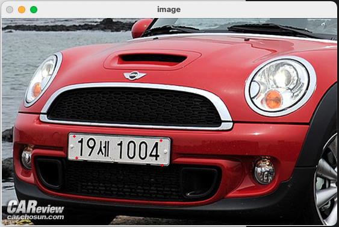
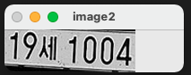
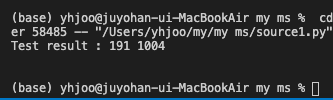

# Tesseract와 Opencv를 활용해 번호판에서 번호 위치를 명시하고, 글자를 읽어들이기

## 배경
- 엉엉 Tesseract가 무료로 OCR 써보기엔 좋은데 글자 위치 return이 안돼 ㅠㅠ
- 그래서 opencv로 글자 읽을 위치 지정해주면 그 위치에서 글씨 읽을 수 있게 만듦
- 혹시 위치가 여러 개일 수도 있고 하니 파일명 입력해서 위치 저장하고, 다시 불러올 수 있게 만듦

## 사용 환경
- Mac OS Big Sur 버전 11.1
- Visual Studio Code 1.53.0-insider
- Python 3.8.5

## 파이썬 패키지 리스트
- astroid 2.4.2
- isort 5.7.0
- lazy-object-proxy 1.4.3
- mccabe 0.6.1
- numpy 1.19.5
- opencv-python 4.5.1.48
- Pillow 8.1.0
- pip 20.3.3
- pyline 2.6.0
- pytesseract 0.3.7
- setuptools 51.1.2
- six 1.15.0
- toml 0.10.2
- wheel 0.36.2
- wrapt 1.12.1

## 환경설정
1. 가상환경 생성 후 실행
    ~~~
    python3 -m venv ocr-prj 
    source ocr-prj/bin/activate 
    ~~~
2. 필요 패키지 설치 (위 패키지 리스트 참조)
    ~~~
    pip3 install opencv-python 
    ~~~
3. Tesseract 설치
    ~~~
    brew install tesseract
    pip3 install pytesseract
    ~~~

## 실행 방법
1. main.py 파일 실행
2. line 8에 파일 이름 입력 (샘플코드에서는 sample1.jpg 사용)
3. 파일 실행 시 입력한 이미지가 새창에서 열림
    
4. 새 창에서 캡쳐 원하는 구역(ROI)가 되는 부분의 네 꼭지점 클릭. 클릭하면 빨간색 점으로 표시됨(네번을 넘어가면 저장 안됨)
    
5. 네번 클릭 후에는 esc 눌러서 종료. 종료 후 따낸 관심영역이 파일 이름따라 txt파일로 저장되고, 결과 이미지가 새창으로 뜸. 새 창도 esc눌러서 종료.

    
6. Line 19부터 끝까지는 저장된 포인트 위치 읽어들인 후 그 위치에 tesseract 적용시켜 글자 읽음. 결과적으로 잘 읽어지지는 않음. 

    
